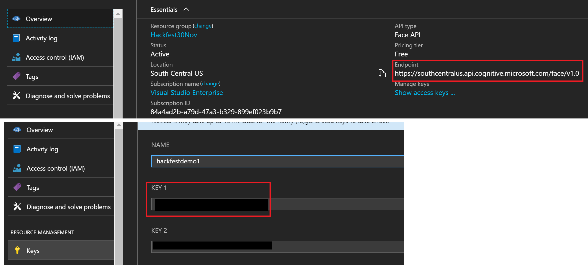

# Hackfest Activity 2
En este proyecto, vamos a realizar una aplicación web para extraer el texto de una imagen y hacer un clasificador de comprobantes de domicilio.
Utilizaremos los siguientes servicios de Azure:

* App Service para el hosting de la aplicación
* Azure Blob Storage para almacenar las imágenes
* OCR de Cognitive Services para la extracción del texto

## Pre requisitos ##
* Contar con una subscripción de Azure
* Instalar o tener descargado Azure Storage Explorer (https://azure.microsoft.com/es-mx/features/storage-explorer/)

## Pasos a seguir ##

1. Abrir Visual Studio 2015 o superior
2. Dar clic en File -> New Project -> Web -> ASP.Net Web Application (.Net Framework)
3. Seleccionar la plantilla MVC
4. Seleccionar la opción "Host in Azure" y configurar las credenciales de su cuenta.
>Ahora requerimos agregar la biblioteca de referencia al explorador de Storage de Azure a través de Nuget.
5. Dar clic derecho en el proyecto en el explorador de soluciones y seleccionar "Manage NuGet Packages".
6. Dar clic en la pestaña de "Browse" y en el buscador, ingresar "Storage".
7. En las opciones resultantes, seleccionar "WindowsAzure.Storage" y dar clic en "Install" y aceptar los términos de las licencias.
Repetir los pasos para descargar la biblioteca "Microsoft.WindowsAzure.ConfigurationManager".
>Vamos a crear nuestra cuenta de Azure Blob Storage en Azure para poder comenzar a configurar nuestra aplicación. 
8. Ingresar al portal de Azure (portal.azure.com)
9. Dar clic en el signo de "+" e ingresar "Storage Account" en el buscador.
10. Seleccionar la opción de Storage Account - blob, file, table, queue. y dar clic en "Create".
11. Para configurar tu cuenta de storage, necesitas ingresar un nombre que solo ocntenga entre 3 y 24 caracteres que conste de letras en minúsculas y números. Por ejemplo, yo escogí "vianeyhackfest1".
12. Configura las propiedades de la cuenta de storage como se muestra en la imagen (Para el grupo de recurso, puedes crear uno nuevo en el que desplegaremos todos los servicios utilizados en esta actividad): 


13. Una vez que se haya creado nuestra cuenta de storage, vamos a abrir la aplicación de Azure Storage Explorer y nos vamos a loggear con nuestras credenciales de Azure.


14. Navegamos hasta la cuenta de storage que acabamos de crear, y vamos a agregar un contenedor nuevo. El nombre del contenedor debe de ser solo con minúsculas

>Una vez creado nuestro contenedor, tenemos que darle permisos de lectura para poder acceder a nuestros archivos. Damos clic derecho a nuestro contenedor, y damos clic en "Set Public Access Level" y seleccionamos la opción "Public Read Acces for Containers and Blobs".
 
>Ahora que ya tenemos nuestro contenedor, vamos a regresar a nuestra aplicación web en Visual Studio para configurarla y poder hacer uso de nuestro Blob Storage.
15. En Visual Studio, abrimos nuestro archivo Web.config, y en la etiqueta de "appSettings" vamos a agregar las siguientes líneas:
```xml
    <add key="StorageAccountName" value="name"/>
    <add key="StorageAccountKey" value ="key"/>
```
>El nombre de la cuenta de storage y la llave, la vamos a obtener del portal de Azure, navegando a nuestra cuenta de storage, seleccionar "Access Key" en el menú derecho, y ahí encontramos la información.
 

16. En el proyecto voy a agregar una clase llamada "StorageServices.cs" en la que voy a acceder a la cuenta de storage. Esto lo logro dando clic derecho en el proyecto, luego "Add" -> "New item".
17. Seleccionar la opción "Code" en el menú izquierdo y por último seleccionar "Class". Recuerda llamar a tu clase "StorageServices.cs" y da clic en "Add".
18. En la clase vamos a agregar las bibliotecas de Microsoft Azure, Microsoft Azure Storage y Microsoft Azure Storage Blob. También necesitamos configurar nuestra cadena de conexión en el código con la obtenida de nustra cuenta de storage en el portal de Azure y el nombre de nuestro contenedor. El código se verá así: 

```cs
using Microsoft.Azure;
using Microsoft.WindowsAzure.Storage;
using Microsoft.WindowsAzure.Storage.Blob;
using System;

namespace HackfestNov30_Activity1
{
    public class StorageServices
    {
        static string account = CloudConfigurationManager.GetSetting("StorageAccountName");
        static string key = CloudConfigurationManager.GetSetting("StorageAccountKey");

           
        public CloudBlobContainer GetCloudBlobContainer()
        {

            string connString = "DefaultEndpointsProtocol = https; AccountName = ; AccountKey = / 2//8wRcBlwBXxaZnhZdHmw2wZrgYQ==;EndpointSuffix=core.windows.net";
            string destContainer = "imagerecognition";

            CloudStorageAccount storageAccount = CloudStorageAccount.Parse(connString);
            CloudBlobClient blobClient = storageAccount.CreateCloudBlobClient();
            CloudBlobContainer blobContainer = blobClient.GetContainerReference(destContainer);
            if (blobContainer.CreateIfNotExists())
            {
                blobContainer.SetPermissions(new BlobContainerPermissions
                {
                    PublicAccess = BlobContainerPublicAccessType.Blob
                });

            }
            return blobContainer;

        }
    }
}
```

19. Cuando hayamos terminado de configurar la aplicación, navegamos a nuestro controlador HomeController.cs y agregamos la siguiente referencia:
```cs
   using Microsoft.WindowsAzure.Storage.Blob;
```
> Y agregamos los siguientes métodos, que serán nuestros controladores para subir y borrar las imágenes en nuestra aplicación.
```cs
   StorageServices storageServices = new StorageServices();
        public ActionResult Upload()
        {
            CloudBlobContainer blobContainer = storageServices.GetCloudBlobContainer();
            List<string> blobs = new List<string>();
            foreach (var blobItem in blobContainer.ListBlobs())
            {
                blobs.Add(blobItem.Uri.ToString());

            }
            return View(blobs);
        }

        [HttpPost]
        public ActionResult Upload(FormCollection image)
        {
            foreach (string item in Request.Files)
            {
                HttpPostedFileBase file = Request.Files[item] as HttpPostedFileBase;
                if (file.ContentLength == 0)
                    continue;

                if (file.ContentLength > 0)
                {

                    CloudBlobContainer blobContainer = storageServices.GetCloudBlobContainer();
                    CloudBlockBlob blob = blobContainer.GetBlockBlobReference(file.FileName);
                    blob.UploadFromStream(file.InputStream);
                }
            }
            return RedirectToAction("Upload");
        }

        [HttpPost]
        public string DeleteImg(string Name)
        {
            Uri uri = new Uri(Name);
            string filename = System.IO.Path.GetFileName(uri.LocalPath);
            CloudBlobContainer blobContainer = storageServices.GetCloudBlobContainer();
            CloudBlockBlob blob = blobContainer.GetBlockBlobReference(filename);
            blob.Delete();
            return "File Successfully Deleted";

        }
```

20. Ahora tenemos que crear nuestra vista. En nuestro explorador de soluciones en Visual Studio, navegamos a Views -> Home -> Add -> View.
21. Nombrar la vista como "Upload" y crear.
22. En esta vista que creamos, haremos la referencia a los métodos agregados en nuestro HomeController para mostrar, subir y borrar las imágenes. El cpodigo quedará así:

```html
@{ 
    ViewBag.Title = "Upload";
} 
<h2 style="padding-left:80px;">Análisis de comprobantes de domicilio</h2> 
<div class="container-fluid" style="padding-left:80px;">
    <div class="row no-margin-bottom">
        <div style="width:100%">
            <p style="float:left;">
                @using (Html.BeginForm("Upload", "Home", FormMethod.Post, new { enctype = "multipart/form-data" }))
            {
                    <div> Selecciona el comprobante de domicilio</div>
                    <input type="file" id="upload1" name="identificacion" />
                    <input type="submit" id="submit1" value="Upload" />
                }
            </p>
            
        </div>
        <div style="">
            <div> Clasificación de comprobante </div>
            <label id="confianza"></label>
</div>
        <table style="margin-top:20px">
            <tr>
                <td>
                    <table class="table" style="width:200px; ">
                        <tr>
                            <td style="width:50%"> Imagen </td>
                            <td style="width:50%"> Texto </td>
                            <td style="width:25%"> Borrar </td>
                        </tr>

                        @if (Model.Count == 1)
                        {

                            <tr>
                                <td>  </td>
                                <td>
                                    <div id="TextoDetectado">
                                        <input type="button" id="@Model[0]" onclick="verifyReceipt('@Model[0]');" value="Mostrar Texto" />
                                        <textarea id="reciboTexto" class="UIInput" style="width:200px; height:200px;"></textarea>
                                    </div>
                                </td>
                                <td>
                                    <input type="button" id="@Model[0]" onclick="deleteImage('@Model[0]');" value="Delete" />
                                </td>
                            </tr>
                        }


                    </table>
                </td>
                <td style="width:100px"> </td>
            </tr>
        </table>
        <script>
            function deleteImage(item) {
                var url = "/Home/DeleteImg";
                $.post(url, { Name: item }, function (data) {
                    window.location.href = "/Home/Upload";
                });
            }
        </script>

```

>En este momento puedes desplegar tu aplicación, notarás que aparece un botón con la etiqueta "Mostrar Texto". Este botón es el que hará todo lo relacionado con servicios cognitivos. Que será la siguiente parte del ejercicio.

##Cognitive Services##

>Lo primero que necesitamos hacer es generar nuestro servicio de 
23. Entrar al portal de Azure (portal.azure.com).
24. Dar clic en el botón de + e ingresar "Cognitive Services".
25. Seleccionar Cognitive Services y dar clic en "Create".
26. Configura el servicio con el tipo de API de "Computer Vision API":
 

27. Una vez que se generó nuestro servicio, podemos ir a la pestaña de "Overview" para obtener nuestro endpoint URL y a la pestaña de llaves para obtener nuestra llave. Estos datos los usaremos después.
 
>El flujo para obtener el texto de la imagen es:
* Obtener el texto de la imagen, y aplicar las reglas necesarias para clasificarlo.
>El script que utilizaremos en nuestra vista Upload (Upload.cshtml) quedará así
```html
                <script>
            var id1;
            var id2;
            // **********************************************
            // *** Update or verify the following values. ***
            // **********************************************

            // Replace the subscriptionKey string value with your valid subscription key.
            var subscriptionKey = "";

            // Replace or verify the region.
            //
            // You must use the same region in your REST API call as you used to obtain your subscription keys.
            // For example, if you obtained your subscription keys from the westus region, replace
            // "westcentralus" in the URI below with "westus".
            //
            // NOTE: Free trial subscription keys are generated in the westcentralus region, so if you are using
            // a free trial subscription key, you should not need to change this region.
            var uriBase = "https://westcentralus.api.cognitive.microsoft.com/vision/v1.0/ocr";
            

            function deleteImage(item) {
                var url = "/Home/DeleteImg";
                $.post(url, { Name: item }, function (data) {
                    window.location.href = "/Home/Upload";
                });
            }
 
            function verifyReceipt(item) {
                

                // Request parameters.
                var params = {
                    "language": "unk",
                    "detectOrientation ": "true",
                };


                // Perform the REST API call.
                $.ajax({
                    url: uriBase + "?" + $.param(params),

                    // Request headers.
                    beforeSend: function (jqXHR) {
                        jqXHR.setRequestHeader("Content-Type", "application/json");
                        jqXHR.setRequestHeader("Ocp-Apim-Subscription-Key", subscriptionKey);
                    },

                    type: "POST",

                    // Request body.
                    data: '{"url": ' + '"' + item + '"}',
                })

                .done(function (data) {
                    // Show formatted JSON on webpage.
                    
                    $("#reciboTexto").val(JSON.stringify(data, null, 2));
                     validateText(data);
                })

                .fail(function (jqXHR, textStatus, errorThrown) {
                    // Display error message.
                    var errorString = (errorThrown === "") ? "Error. " : errorThrown + " (" + jqXHR.status + "): ";
                    errorString += (jqXHR.responseText === "") ? "" : (jQuery.parseJSON(jqXHR.responseText).message) ?
                        jQuery.parseJSON(jqXHR.responseText).message : jQuery.parseJSON(jqXHR.responseText).error.message;
                    alert(errorString);
                });
            }

            function validateText(data) {

              //  alert(data.regions[0].lines[0].words[0].text);
                var texto = '';

               for (var i = 0; i < data.regions.length; ++i) {
                    var linesA = data.regions[i];
                    for (var j = 0; j < linesA.lines.length; j++) {
                        var wordsA = data.regions[i].lines[j];
                        for (var k = 0; k < wordsA.words.length; k++) {
                            texto += data.regions[i].lines[j].words[k].text;
                            texto += ' ';
                        }
                    }
               }
               //alert(texto);
                //Validar recibo TELMEX
               var telmex1 = 'TELMEX';
               var telmex2 = 'Folio';
               var cfe1 = 'AVISO RECIBO';
               var cfe2 = 'Comisión Federal de Electricidad';
                var te
               if (texto.indexOf(telmex1) != -1 && texto.indexOf(telmex2)!= -1) {
                   document.getElementById('confianza').innerHTML = 'El comprobante recibido es TELMEX';
               } else if (texto.indexOf(cfe1)!= -1 && texto.lastIndexOf(cfe2)) {
                   document.getElementById('confianza').innerHTML = 'El comprobante recibido es CFE';
               } else {
                   document.getElementById('confianza').innerHTML = 'No se reconoce el comprobante';
               }

            }
        </script>

```

